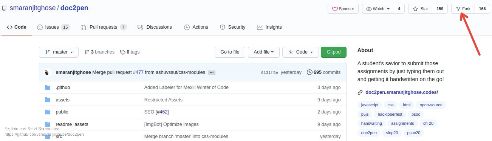
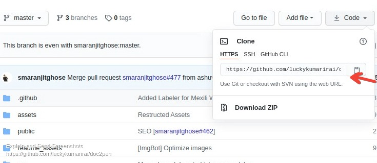
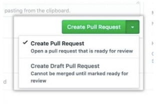
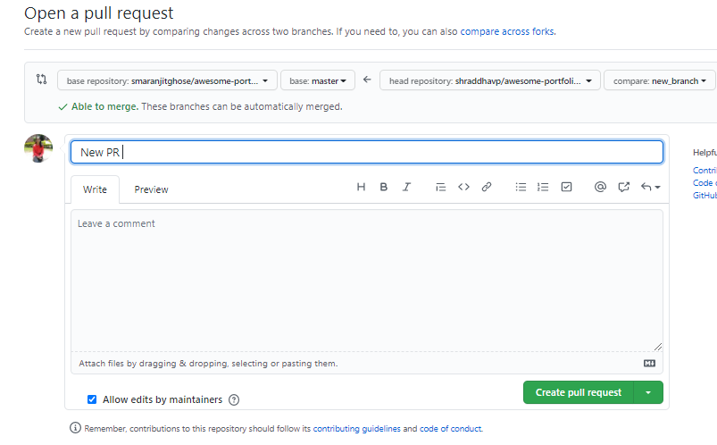

# Contributing Guidelines :paperclip: 
  
This documentation contains a set of guidelines to help you during the contribution process.   
We are happy to welcome all the contributions from anyone willing to improve/add new scripts to this project. Thank you for helping out and remember, No contribution is too small.

#  File Structure of the project :file_folder:

#### Public Directory Structure 

This folder contains the stylesheets, images and fonts. Any files within this directory will not be processed by Webpack but copied directly to the build folder.

Below are the subdirectories within the public folder :open_file_folder:

- src/fonts

Below are the files which are directly located inside the public folder:

- favicon.ico

- index.html

- logo192.png

- logo512.png

- manifest.json

- robots.txt

-------------------------------------------------------

### Src Directory Structure

This folder contains all the main source code for the React application.

Below are the subdirectories within the src folder :

- src/assets/

- src/components/

- src/fonts

- src/pages

Below are the files which are directly located inside the src folder:

- App.js

- index.css

- index.js

-------------------------------------------------------

### src/assets

This folder contains all the community brand assets

-------------------------------------------------------

### src/components

This folder contains all the components used within **more than one** pages of the website.

-------------------------------------------------------

### src/fonts

This folder contains the fonts used in the website

-------------------------------------------------------

### src/pages/<page_name>/ :page_with_curl:

these folder has the following files and folders.

- index.js **(sections all the sections of the page. You can find all the UI implementations of the section in section folder.)**

- style.css **(contains styles used in this particular page only)**

- sections/ **(has all sections used in the page.)**

- components/ **(reusable components which can be used by any section of *only* this page.)**

- sections/ **(has all sections used in the page.)**

- containers/ (for react state management works (using React Context API))
  
  
# Submitting Contributions 👩‍💻👨‍💻  
Below you will find the process and workflow used to review and merge your changes.

## Step:zero: How to start ? :boom: :sunrise:

##### 1. If you don't have git on your machine, [install it](https://docs.github.com/en/github/getting-started-with-github/set-up-git)

```sudo apt install git```

##### 2. Setup the github account

##### 3. Fork [this](https://github.com/smaranjitghose/doc2pen.git) repository.:memo:

- Fork this Repository. This will create a Local Copy of this Repository on your Github Profile. Keep a reference to the original project in `upstream` remote. 


##### 4. Clone your forked copy of the project.

```
git clone  https://github.com/<your_user_name>/smaranjitghose/doc2pen.git  
```


##### 5. Navigate to the project directory :file_folder: .

```
cd doc2pen
```

##### 6. Add a reference to the original repository.

```
git remote add upstream https://github.com/smaranjitghose/doc2pen.git 
```

##### 7. Check the remotes for this repository.

```
git remote -v
```

##### 8. Always take a pull from the upstream repository to your master branch to keep it at par with the main project(updated repository).

```
git pull upstream master
```

##### 9. If you have already forked the project, update your copy before working.  
```  
$ git remote update  
$ git checkout <branch-name>  
$ git rebase upstream/<branch-name>  
``` 
## Step:one: Setup the project in your local system :computer:

##### 1.Change working directory to project-

``` 
cd doc2pen
```

##### 2. To install all packages 

``` 
npm install 
```

##### 3.Local test run

```
npm start
```
##### 4.Now you can now view doc2pen in the browser.

  ``` http://localhost:3000 ```

## step :two:. Identify what you want to contribute :eyes:

- If you want to add or change a major feature, create an issue and discuss with the maintainer what you would like to change.
- If you want to work on an Existing Issues or an Issue that you created, check if anyone is working on that issue.
- If no one is working on the issue, just comment and start working on it otherwise wait for the Issue to be assigned to you.

##### 1. Create a new branch :herb:

- Make a branch if you are working on a major features.
- Use its name to identify the issue your addressing. 
- DO NOT name it MAIN or MASTER or anything with like 8904thfbn.
 
	###### It will create a new branch with name Branch_Name and switch to that branch

```
git checkout -b <your_branch_name>
```
Our branching strategy is based on [this article](https://nvie.com/posts/a-successful-git-branching-model/) which I suggest you read.

+  **master** a history of releases, once merged to from develop and tagged we create a release on the play store & GitHub releases.

+  **develop**  the actively worked on next release of the app, what we branch off of while working on new features and what we merge into upon feature completion

+ **feature/** or feature/\<username\>/ any branch under this directory is an actively developed feature, feature branches culminate in a PR, are merged and deleted.
 Typically a feature branch is off of develop and into develop but in rare scenarios if there is an issue in production a branch may be made off master to fix this issue, this type of feature branch must be merged to develop and master before being deleted.
Branch names should be in the format **\<issue-number\>-kebab-case-title**

All branches should have distinct history and should be visually easy to follow, for this reason only perform merge commits when merging code either by PR or when synchronising.

If you wish to rebase you should be following the [Golden Rule](https://www.atlassian.com/git/tutorials/merging-vs-rebasing#the-golden-rule-of-rebasing) and ahere to the advice in the heading [Aside: Rebase as cleanup is awesome in the coding lifecycle](https://www.atlassian.com/git/articles/git-team-workflows-merge-or-rebase).

## Step:three: Work Remotely 👩‍💻
- Now you are ready to your work to the remote repository.
- Perfom your desired changes to the code base.
- Add all the files/folders needed.  
- Check the outcome
- Make a small clip or take screenshots

<p align="center"></p>


##### 1. To add all changes :clipboard:

- After you've made changes or made your contribution to the project add changes to the branch you've just created by: 

###### To add all new files to branch Branch_Name 

```   
$ git add .  
```

###### To add only a few files to Branch_Name

```
$ git add <some_file_name>
```
##### 2. Commit your changes :pencil2:

- To commit give a descriptive message for the convenience of reviewer.
- This message get associated with all files you have changed. 

```
git commit -m "Relevant message"
```

##### 3. Push the committed changes in your feature branch to your remote repo.

```
git push -u origin <your_branch_name>
```
## step:four: PR Guidlines

 - To create a pull request, click on `compare and pull requests`. Please ensure you compare your feature branch to the desired branch of the repo you are suppose to make a PR to.


##### 1. Then add an appropriate title and description to your pull request that explains your changes and efforts done.


##### 2. Click on `Create Pull Request`
 
    
  

- Voila! You have made a PR to the doc2pen project boom . Sit back patiently and relax while the project maintainers review your PR and merged.🥳 
 
## Linting :grey_exclamation:

PR should be linted properly locally. There is no system restriction applied for this, however, PRs will not be merged until they contain properly formatted code.

## Continous Integration

All PRs will have all these tests run and a combined coverage report will be attached, if coverage is to go down the PR will be marked failed. On Travis CI the automated tests are run on an emulator.

## Need more help?🤔  
You can refer to the following articles on basics of Git and Github and also contact the Project Mentors, in case you are stuck:  
- [Forking a Repo](https://help.github.com/en/github/getting-started-with-github/fork-a-repo)  
- [Cloning a Repo](https://help.github.com/en/desktop/contributing-to-projects/creating-an-issue-or-pull-request)  
- [How to create a Pull Request](https://opensource.com/article/19/7/create-pull-request-github)  
- [Getting started with Git and GitHub](https://towardsdatascience.com/getting-started-with-git-and-github-6fcd0f2d4ac6)  
- [Learn GitHub from Scratch](https://lab.github.com/githubtraining/introduction-to-github)  
  
  
## Things to remember while contributing :warning:
* Please make sure to update tests case wherever necessary.
* If any package is used that was not present in the requirements.txt, add the package name and the version used to the requirements.txt file.
=======

# Contributing to Doc2pen :page_facing_up::black_nib:
We love your input! We want to make contributing to this project as easy and transparent as possible, whether it's:

- Reporting a bug :bug:
- Discussing the current state of the code 
- Submitting a fix
- Proposing new features :sparkles:
- Becoming a maintainer :sunglasses:


