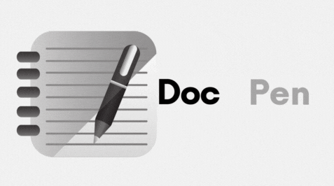
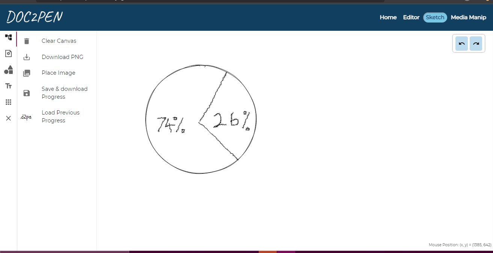
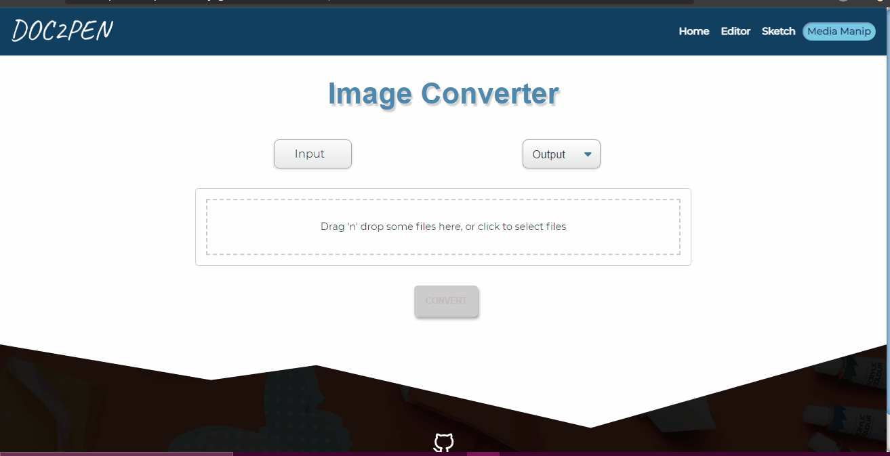

# Doc2Pen

<p align="center"></p>

Are you a student who is tired of having to write out assignments on paper, draw sketches by hand, scan each page, convert it all to a PDF, and finally submit? 😩

Does it seem too much of a hassle in this age of online education? 😫

If your answer is yes, then you've come to the right place! 😃

### Doc2Pen is the 1 stop shop for getting all your "handmade" assignments ready for submission digitally. 🥳

- Use the highly customisable Editor page to type in text and get a handwritten document! 📝
- Use the Sketch page to digitally draw in a handmade style! 🎨
- And in the end, use the Media Manip page to convert your assignment into the appropriate format for submission! 📚

It really is that easy! 🎊

And the best part of all? **Doc2Pen is open source!** 🤩


[](https://github.com/smaranjitghose/doc2pen/blob/master/LICENSE)
&nbsp;

## DEMO

### Home Page


### Editor Page


### Sketch Page



### Media Manip Page



## Features:

- [ ] Type/Paste your assignments and get handwritten ones to download directly! Bye-Bye Pen&Paper
- [ ] Make Sketches/Diagrams/Figures for your assignments/presentations
- [ ] Media Manager
  - [ ] PDF Spliter
  - [ ] PDF Merger
  - [ ] PNG to JPG
  - [ ] JPG to PNG
  - [ ] PNG to WEBP
  - [ ] WEBP to PNG
  - [ ] JPG to WEBP
  - [ ] WEBP to PNG
  - [ ] JIFF to PNG
  - [ ] JIFF to JPG
  - [ ] PNG(multiple) to PDF

## Basic structure of the project repository 🗃️📂

```terminal
|
|- readme_assets   # Contains all the images used for the README.MD
|- public          # Contains the stylesheets, images and fonts. Any files within this directory will not be processed by Webpack but copied directly to the build folder.
|- src:            # Contains all source code for the React application.
    |
    |- App.js
    |- index.css
    |- index.js
    |-assets         # Contains all the community brand assets
    |-components     # Contains all the components used within the app.
    |-fonts          # Contains all the fonts
    |-pages          # Contains all the sections of the page.
          |- 404
          |- Home
          |- Editor
          |- Sketch
    |-seo # Contains code for meta tags using react-helmet
```

### Tech Stack: 💻

  

## Under the hood:

- [React - Bootstrap](https://react-bootstrap.github.io/)
- [React - Helmet](https://www.npmjs.com/package/react-helmet): Document Head Management
- [React - Leaflet.js](https://react-leaflet.js.org/): Interactive Maps
- [React - Dropzone.js](https://react-dropzone.js.org/): Drag and drop file uploads
- [Rough.js](https://roughjs.com/): Make sketchy, hand drawn figures
- [Mousetrap](https://github.com/ccampbell/mousetrap): Handling Keyboard shortcuts
- [ReactJS - Snackbar](https://www.npmjs.com/package/react-js-snackbar): Making snackbars to provide brief messages
- [React Reveal](https://www.react-reveal.com/): Animations
- [JSPDF](https://www.npmjs.com/package/jspdf): Generate PDFs
- [React Scroll](https://www.npmjs.com/package/react-scroll): Smooth Scrolling between sections

## Wish to fix a bug or add a new feature?[](https://github.com/dwyl/esta/issues)🤝🏽🍀:

<p align = "center"></p>

Please check out our [contribution guidelines](./CONTRIBUTING.md)

## The geeks🤓 behind this initiative:

**Our Project Maintainers👨‍🏫:**

<p align="center">
&ensp;&ensp;&ensp;

</p>

<a href="https://github.com/smaranjitghose">
<h5 align="center"><b>Smaranjit Ghose</b></a>&ensp;&ensp;&ensp;&ensp;&ensp;&ensp;&ensp;&ensp;&ensp;&ensp;&ensp;&ensp;&ensp;
<a href="https://github.com/anushbhatia"><b>Anush Bhatia</b></h5></a>

**Our valuable Contributors👩‍💻👨‍💻**
<a href="https://github.com/smaranjitghose/doc2pen/graphs/contributors">

</a>

## Open Source Programs we have been associated with:

<p align="center">
<a href="https://www.pclubsummerofcode.in/"></a>
<a href="https://hakincodes.tech/"></a>
<a href="https://devscript.tech/woc/"></a>
</a>
<a href="https://slop.dscdaiict.in/projects"></a>
<a href="https://swoc.tech/"></a>
<a href="https://crosswoc.ieeedtu.in/"></a>
<a href="https://mexili.github.io/winter_of_code/"></a>
<a href="https://gssoc.girlscript.tech/"></a>
</p>

## Code of Conduct

<p align="center"></p>

## License

<p align="center"></p>

## Made with ♥ for the students of the world!
