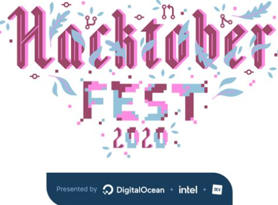
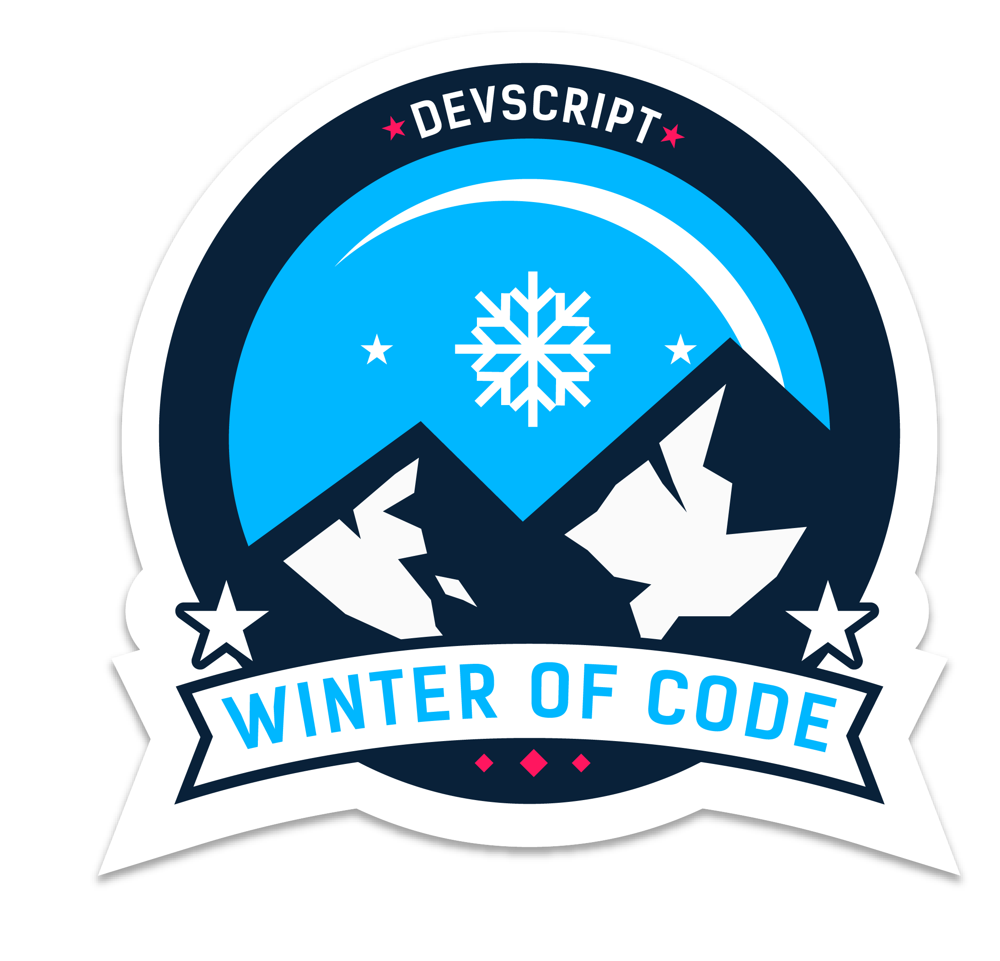

<h1 align= "center"><b>Doc2Pen</b></h1>

-----

Don't you find it boring and real burdensome task when it comes to finish the assignments???? and THAT TOO BY WRITING THEM IN A PIECE OF PAPER?!?!?! OH DEAR LORD.😩😵

<b>The truth is your assignments can be completed must faster by typing rather than writing,isn't it?😏🤓</b>

 

Just imagine

How cool it would be if your typed documents could be converted in handwritten documents!!!🤯😱

 And here we are .....

-----

## About 🤔💭:
Doc2pen is an Open Source Software that converts your Typed Docs into Handwritten Docs.

----

<h2> Features✨✨ :</h2>
<ul>
<li>You can change the colour of ink.</li>
<li>Variety of Page styles to choose from.</li>
<li>Wide variety of options to customize the fonts as your handwriting.</li>
<li>You can even adjust the margins and line spacings.</li>
<li>Download/Export in .pdf, .jpeg, .jpg, .png format</li>
</ul>

-----

<h2> What goes under the hood🧱⚙:</h2>
<code></code>
<code></code>
<code></code>
<code></code>

----

<h2> Love for Open Source ❤🙌🏽:</h2>
<ul>
<li><b>Our Product Enhances : </b>As we know, <b>"Team Work leads to the Efficiency of any Task"</b>  So, we kept it Open Source to build our Team, leading to an Efficient Solution to the Problem.</li>
<li><b>Your Skills Enhance : </b> Increase your skillset through <b>Learning By Doing</b> method. We are a part of various Open Source Events, namely, <b>Hacktoberfest, Hakincodes</b>,<b>DevScript Winter of Code </b>and <b>PClub Summer Of Code</b></li>
</ul>

-----

## Contributing 🤝🏽🍀:
<ul>
<li>First time in open source??? We got your <a href="https://github.com/smriti1313/doc2pen/blob/master/.github/contribution.md">back.</li></a>
</ul>

------

## The brains behind this🧠👀:

#### Our hard working Project Maintainers👨‍🏫👨‍:

&ensp;&ensp;&ensp;

<a href="https://github.com/smaranjitghose">
<h5 align="center"><b>Smaranjit Ghose</b></a>&ensp;&ensp;&ensp;&ensp;&ensp;&ensp;&ensp;&ensp;&ensp;&ensp;&ensp;&ensp;&ensp;
<a href="https://github.com/anushbhatia"><b>Anush Bhatia</b></h5></a>
 
#### Our valuable Contributors👩‍💻👨‍💻 :

-----

## Open Source Programs we have been associated with🔗🖥: 

  

-----

## License📜📜:
[MIT](https://github.com/smriti1313/doc2pen/blob/master/LICENSE)

-----

## Code of conduct📝📝:

It'd be great if you read [this](https://github.com/smaranjitghose/doc2pen/blob/master/CODE_OF_CONDUCT.md) once.

-----

