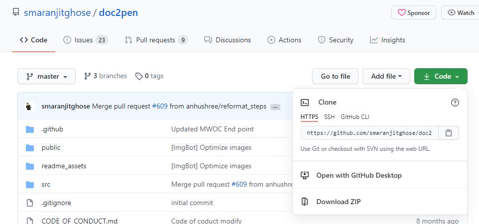
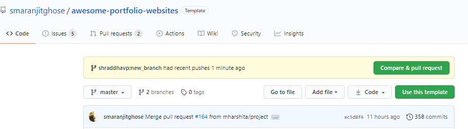

# Doc2Pen

<p align="center">Don't you find it boring and real burdensome task when it comes to finish the assignments???? and THAT TOO BY WRITING THEM IN A PIECE OF PAPER?!?!?! OH DEAR LORD.😩😵</p>
<p align="center">
</p>


<p align="center"><b>The truth is your assignments can be completed must faster by typing rather than writing,isn't it?😏🤓</b></p>
<p align="center">

</p>
<br>

<p align="center">Just imagine</p>
<p align="center">How cool it would be if your typed documents could be converted in handwritten documents!!!🤯😱</p>
<p align="center"> And here we are .....</p>
<p align="center"></p>

## About 🤔💭:
Doc2pen is an Open Source Software that converts your Typed Docs into Handwritten Docs.

## Features✨✨ :

- You can change the colour of ink.
- Variety of Page styles to choose from.
- Wide variety of options to customize the fonts as your handwriting.
- You can even adjust the margins and line spacings.
- Download/Export in .pdf, .jpeg, .jpg, .png format

## What goes under the hood🧱⚙:
<code></code>
<code></code>
<code></code>
<code></code>


## Contribution Guidelines[](https://github.com/dwyl/esta/issues)🤝🏽🍀:

Are we missing any of your favorite features which you think you can add to it❓ Perhaps something you can enhance or fix a malicious bug❓ We invite you to contribute to this project and make it better!

To start contributing, follow the below guidelines: 

**1.**  Fork [this](https://github.com/smaranjitghose/doc2pen) repository.

**2.**  Clone your forked copy of the project.

```
git clone --depth 1 https://github.com/<your_user_name>/doc2pen.git
```


**3.** Navigate to the project directory :file_folder: .

```
cd doc2pen
```

**4.** Add a reference(remote) to the original repository.

```
git remote add upstream https://github.com/smaranjitghose/doc2pen.git 
```

**5.** Check the remotes for this repository.

```
git remote -v
```

**6.** Always take a pull from the upstream repository to your master branch to keep it at par with the main project(updated repository).

```
git pull upstream master
```

**7.** Create a new branch.

```
git checkout -b <your_branch_name>
```

**8.** Perform your desired changes to the code base.

<p align="center"></p>

**9.** Track your changes:heavy_check_mark: .

```
git add . 
```

**10.** Commit your changes .

```
git commit -m "Relevant message"
```

**11.** Push the committed changes in your feature branch to your remote repo.

```
git push -u origin <your_branch_name>
```

**12.** To create a pull request, click on `compare and pull requests`. Please ensure you compare your feature branch to the desired branch of the repo you are supposed to make a PR to.



**13.** Add appropriate title and description to your pull request explaining your changes and efforts done.


**14.** Click on `Create Pull Request`.


**15** Voila :exclamation: You have made a PR to the doc2pen project :boom: . Sit back patiently and relax while the project maintainers review your PR. Please understand at times the time can vary from a few hours to a few days

<p align="center"></p>

## The geeks🤓 behind this initiative:

#### Our Project Maintainers👨‍🏫:

<p align="center">
&ensp;&ensp;&ensp;

</p>

<a href="https://github.com/smaranjitghose">
<h5 align="center"><b>Smaranjit Ghose</b></a>&ensp;&ensp;&ensp;&ensp;&ensp;&ensp;&ensp;&ensp;&ensp;&ensp;&ensp;&ensp;&ensp;
<a href="https://github.com/anushbhatia"><b>Anush Bhatia</b></h5></a>

#### Our valuable Contributors👩‍💻👨‍💻 :
<a href="https://github.com/smaranjitghose/doc2pen/graphs/contributors">
  
</a>

## Open Source Programs we have been associated with: 

<p align="center">
<a href="https://www.pclubsummerofcode.in/"></a>
<a href="https://hakincodes.tech/"></a>
<a href="https://devscript.tech/woc/"></a>
<a href="https://swoc.tech/"></a>
<a href="http://jwoc2k20.tech/"></a>
<a href="https://mexili.github.io/winter_of_code/"></a>
<a href="https://gssoc.girlscript.tech/"></a>
</p>

## Code of Conduct
<p align="center"></p>

## License 
<p align="center"></p>
