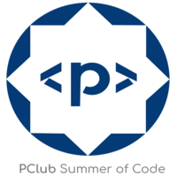
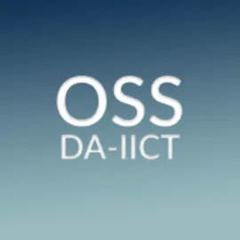
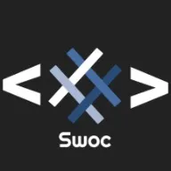
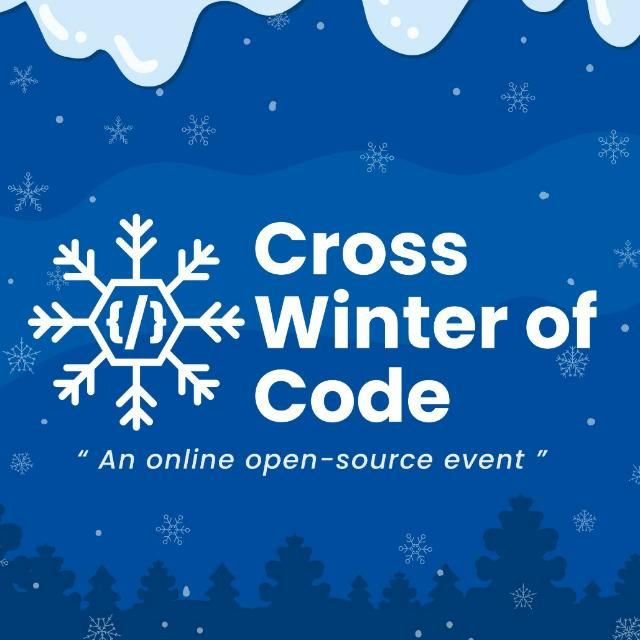
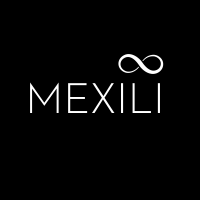

# Doc2Pen

An open source project aimed at making your student life easier!


## DEMO

<!-- 
-----------
Add GIFs of the entire web app
-----------
-->

## Features:

- [ ] Type/Paste your assignments and get handwritten ones to download directly! Bye-Bye Pen&Paper
- [ ] Make Sketches/Diagrams/Figures for your assignments/presentations
- [ ] Media Manager
  - [ ]  PDF Spliter
  - [ ]  PDF Merger
  - [ ]  PNG to JPG
  - [ ]  JPG to PNG
  - [ ]  PNG to WEBP
  - [ ]  WEBP to PNG
  - [ ]  JPG to WEBP
  - [ ]  WEBP to PNG
  - [ ]  JIFF to PNG
  - [ ]  JIFF to JPG
  - [ ]  PNG(multiple) to PDF


## Basic structure of the project repository 🗃️📂


```terminal
|
|- readme_assets   # Contains all the images used for the README.MD
|- public          # Contains the stylesheets, images and fonts. Any files within this directory will not be processed by Webpack but copied directly to the build folder.
|- src:            # Contains all source code for the React application.
    |
    |- App.js
    |- index.css
    |- index.js
    |-assets         # Contains all the community brand assets
    |-components     # Contains all the components used within the app.
    |-fonts          # Contains all the fonts 
    |-pages          # Contains all the sections of the page.
          |- 404
          |- Home
          |- Editor
          |- Sketch
    |-seo # Contains code for meta tags using react-helmet
```


## Wish to fix a bug or add a new feature?[](https://github.com/dwyl/esta/issues)🤝🏽🍀:


<p align = "center"></p>

Please check out our [contribution guidelines](./CONTRIBUTING.md)

## The geeks🤓 behind this initiative:


**Our Project Maintainers👨‍🏫:**

<p align="center">
&ensp;&ensp;&ensp;

</p>

<a href="https://github.com/smaranjitghose">
<h5 align="center"><b>Smaranjit Ghose</b></a>&ensp;&ensp;&ensp;&ensp;&ensp;&ensp;&ensp;&ensp;&ensp;&ensp;&ensp;&ensp;&ensp;
<a href="https://github.com/anushbhatia"><b>Anush Bhatia</b></h5></a>

**Our valuable Contributors👩‍💻👨‍💻**
<a href="https://github.com/smaranjitghose/doc2pen/graphs/contributors">
  
</a>

## Open Source Programs we have been associated with: 

<p align="center">
<a href="https://www.pclubsummerofcode.in/"></a>
<a href="https://hakincodes.tech/"></a>
<a href="https://devscript.tech/woc/"></a>
</a>
<a href="https://slop.dscdaiict.in/projects"></a>
<a href="https://swoc.tech/"></a>
<a href="https://crosswoc.ieeedtu.in/"></a>
<a href="https://mexili.github.io/winter_of_code/"></a>
<a href="https://gssoc.girlscript.tech/"></a>
</p>

## Code of Conduct
<p align="center"></p>

## License 
<p align="center"></p>


## Made with ♥ for the students of the world!
